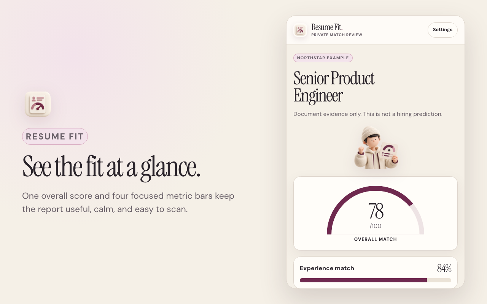

<p align="center">
  
</p>

<h1 align="center">Resume Fit</h1>

<p align="center">Compare your resume with the job open in Chrome.</p>

<p align="center">
  <a href="https://github.com/kalyandechiraju/resume-fit/releases/latest">Download the latest release</a>
</p>



Resume Fit is an open-source Manifest V3 Chrome extension. It reads a PDF or DOCX resume, captures the job description in the current tab, and returns a focused match report in Chrome's side panel.

## Install the extension

1. Download `resume-fit-v0.3.0.zip` from the [latest release](https://github.com/kalyandechiraju/resume-fit/releases/latest).
2. Unzip the file.
3. Open `chrome://extensions` in Chrome.
4. Turn on **Developer mode**.
5. Select **Load unpacked**.
6. Choose the unzipped folder that contains `manifest.json`.
7. Pin Resume Fit from Chrome's Extensions menu.

Chrome shows a developer-mode notice for manually installed extensions. Keep the extracted folder in place while the extension is installed.

## Use Resume Fit

1. Open Resume Fit and choose a PDF or DOCX resume.
2. Add your [Vercel AI Gateway API key](https://vercel.com/ai-gateway).
3. Open a job listing in the current tab.
4. Select the Resume Fit icon and confirm the captured job text.
5. Select **Analyze match**.

The extension stores extracted resume text locally. It keeps the current job text and API key in browser-session storage. Analysis sends the confirmed resume and job text through Vercel AI Gateway to TypeSafe Jev. See [PRIVACY.md](PRIVACY.md) for the complete data flow.

## Build from source

Requirements:

- Chrome 116 or later
- Node.js 20 or later
- pnpm 10.17.0

```sh
git clone git@github.com:kalyandechiraju/resume-fit.git
cd resume-fit
corepack enable
pnpm install --frozen-lockfile
pnpm check
```

Load `extension/dist` from `chrome://extensions` using **Load unpacked**.

`pnpm check` runs the TypeScript check, production build, scoring tests, and extension artifact checks.

## Project structure

```text
extension/src/       TypeScript source
extension/static/    Manifest, HTML, CSS, fonts, icons, and illustrations
extension/test/      Node test suite
store-assets/        Release and Chrome Web Store screenshots
```

The product has no website runtime, hosted backend, account system, analytics, persistent content script, or broad host permission. Its only host access is `https://ai-gateway.vercel.sh/*`.

## Contribute

Open an issue before making a large change. For a code change, run `pnpm check` and keep permissions and remote access within the limits documented in [AGENTS.md](AGENTS.md).

## License

[MIT](LICENSE)
